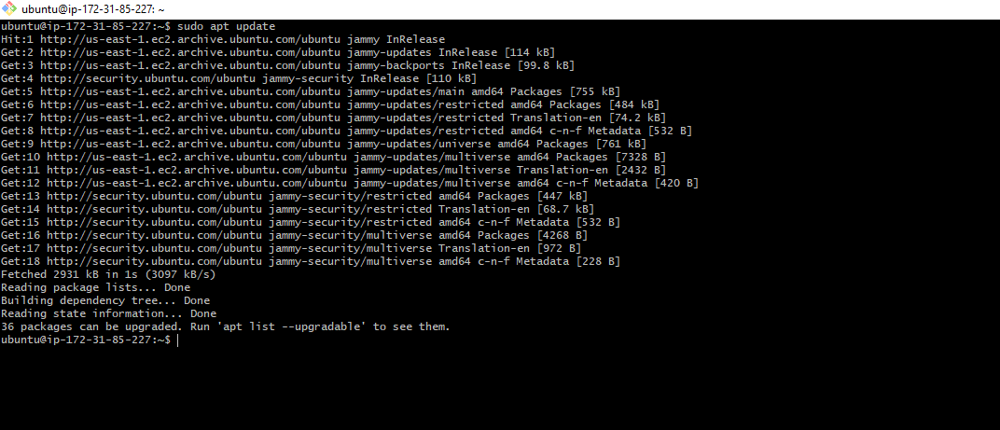

## LAMP STACK IMPLEMENTATION(PROJECT 1)

We are setting up a LAMP STACK using EC2 as our virtual server.
To do this we need to do the following:

* create an account on [AWS](www.aws.amazon.com). 
* we create an instance (virtual machine) by selecting __“ubuntu server 20.04 LTS”__ from Amazon Machine Image(AMI)(free tier). 
* we select “t2.micro(free tier eligible)” 
* then go to the security group and select “existing security group” review and launch.

How to create an aws free tier account. Click [here](https://www.youtube.com/watch?v=xxKuB9kJoYM&list=PLtPuNR8I4TvkwU7Zu0l0G_uwtSUXLckvh&index=7)

This launches us into the instance as shown in the screenshot:


We open our terminal and go to the location of the previously downloaded PEM file:


To know how to download PEM File from __AWS__. Click [HERE](https://intellipaat.com/community/52119/how-to-download-a-pem-file-from-aws).

We connect to the instance from our ubuntu terminal using the command:

```$ ssh -i dybran-ec2.pem ubuntu@44.210.117.5```


This automatically connects to the instance


__APACHE WEB SERVER SETUP__

To install the Apache web server, we first update the software packages in the software package manager by running the command:

```$ sudo apt update```



Next we install the web server(Apache HTTP server) by running the command:

```$ sudo apt install apache2```


To check if the webserver  is running, we use the command:

```$ sudo systemctl status apache2```


We then go to our instance and set the inbound rules and save


We copy the URL and paste on a web browser to check if it is working:


__MYSQL DATABASE SERVER SET UP__

We install the Mysql server by running the command:

```$ sudo apt install mysql-server```


We log into the mysql by running the command:

```$ sudo mysql```


To set password as "PassWord.1" for root user, we run the command:

 ```mysql> ALTER USER 'root'@'localhost' IDENTIFIED WITH mysql_native_password BY 'PassWord.1';```


Then we “exit” the mysql and then run the command to start the interactive script:

```$ sudo mysql_secure_installation```


Logged into mysql using my new password by running the command:

```$ sudo mysql -p```

[Image](./images/ac.PNG)

Then __“exit”__.

__SETTING UP PHP__

To install PHP, we run the command:

```$ sudo apt install php libapache2-mod-php php-mysql```

We check the version by running the command:

```$ php -v```


__CREATING A VIRTUAL HOST FOR APACHE__

To create a virtual host for my website files using apache, we create a directory “projectlamp”
Then change ownership :

```$ sudo mkdir /var/www/projectlamp```
 
```$ sudo chown -R $USER:$USER /var/www/projectlamp```


Created a new configuration file by running the command:

```$ sudo vi /etc/apache2/sites-available/projectlamp.conf```

We place the following in the file we created

```
<VirtualHost *:80>
    ServerName projectlamp
    ServerAlias www.projectlamp 
    ServerAdmin webmaster@localhost
    DocumentRoot /var/www/projectlamp
    ErrorLog ${APACHE_LOG_DIR}/error.log
    CustomLog ${APACHE_LOG_DIR}/access.log combined
</VirtualHost>
```


We save using __":wq" + "Enter"__ 

We enable the new virtual host

```$ sudo a2ensite projectlamp```

We disable the default website that comes with apache.

```$ sudo a2dissite 000-default```

To make sure our configuration files does not contain syntax error:

```$ sudo apache2ctl configtest```

We reload the apache webserver

```$ sudo systemctl reload apache2```

We create a file in /var/www/projectlamp named  “index.html”

```$ touch /var/www/projectlamp/index.html```

We then redirecting these data into the file:

```$ echo 'Hello LAMP from hostname' $(curl -s http://169.254.169.254/latest/meta-data/public-hostname) 'with public IP' $(curl -s http://169.254.169.254/latest/meta-data/public-ipv4) > /var/www/projectlamp/index.html```


we can check on the browser using the url

> ```http://<Public-IP-Address>:80```


To enable PHP on the website, we open this file and edit it:

```$ sudo vim /etc/apache2/mods-enabled/dir.conf```


we use __":wq" + "Enter"__ to save.

Create and open another file in “projectlamp” named “index.php”

```$ vim /var/www/projectlamp/index.php```

Add this to the file

```
<?php
phpinfo();
```


“Save” the file, then go to the browser to refresh


We remove the “index.php” file created in “projectlamp:

```$ sudo rm /var/www/projectlamp/index.php```

### we have successfully deployed a __LAMP STACK WEBSITE__ on __AWS CLOUD__


